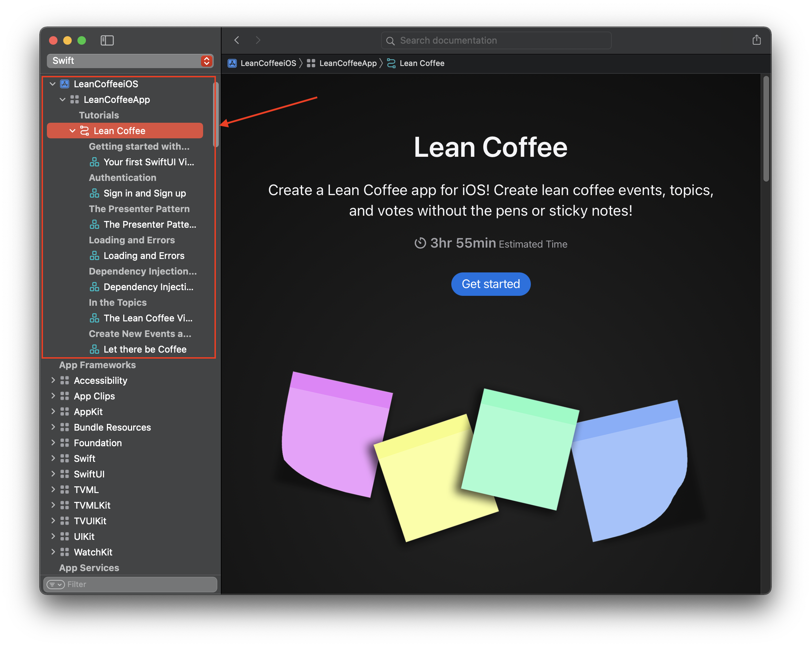

# LeanCoffeeApp Native Swift

This is the root project where you'll learn how to create a mobile application on iOS with SwiftUI.

## What you will need.

You will need to download Xcode 13 _(or later)_ either from the [App store](https://apps.apple.com/us/app/xcode/id497799835?mt=12) or from [Dev.Apple.com](https://developer.apple.com/download/all/).

## Seeing the tutorial

 **Easy Way**

The tutorial is hosted on [Github Pages](https://jzdesign.github.io/LeanCoffee_native_swift_docc/documentation/leancoffeeapp/) or you can pull the project and build the documentation to see it in xCode

**Hard Way**

You can run the project by clicking on the Xcode project file. When it opens it will fetch the Documentation Package that contains the tutorial _(If this fails, you may need to add your git credentials to Xcode from its settings, if it still fails, it's usually related to your ssh configuration. Ask me and I'll help you with it.)_

Once the Swift Package finishes the download, you can press `CMD` + `Control` + `Shift` + `D` to compile the docs and open them. You should see The Apple documentation viewer open. On the left is the navigation. You can open the tutorial there.

### Warning about going Split Screen on your Laptop

As of right now the mobile experience will not always show all of the changed lines of code for a step in the tutorial. Going split screen on a laptop with Xcode + Apple Docs will usually put you into the mobile experience.

## Following the tutorial

This repository holds the necessary code to start the tutorial. When you launch the docs, you can use this Xcode project to follow along.

Now, this tutorial isn't for a total beginner, it does assume some basic knowledge of Swift and Xcode. Here are a couple of helpful resources:

1. To learn a little about Xcode checkout this [tutorial](https://learnappmaking.com/xcode-tutorial/). You can ignore the interface builder, playgrounds, and xcode settings sections for the purposes of this tutorial.
1. For in depth learning about Swift I would check out their [docs](https://docs.swift.org/swift-book/LanguageGuide/TheBasics.html).

We will be interacting with an API that I wrote. The API docs are available [here](https://github.com/JZDesign/LeanCoffeeService) in the README. 

### Using Xcode Previews

From a `*.swift` file:

- To open the preview canvas you can press `option` + `cmd` + `enter`
- To build/resume the preview you can press `option` + `cmd` + `p`
